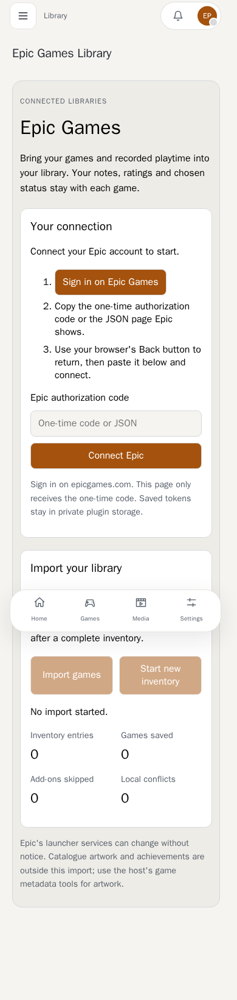
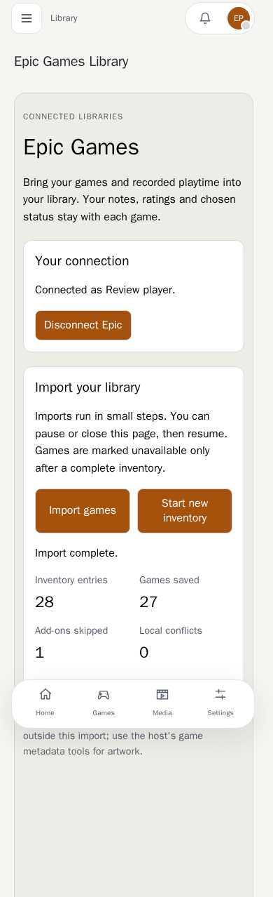
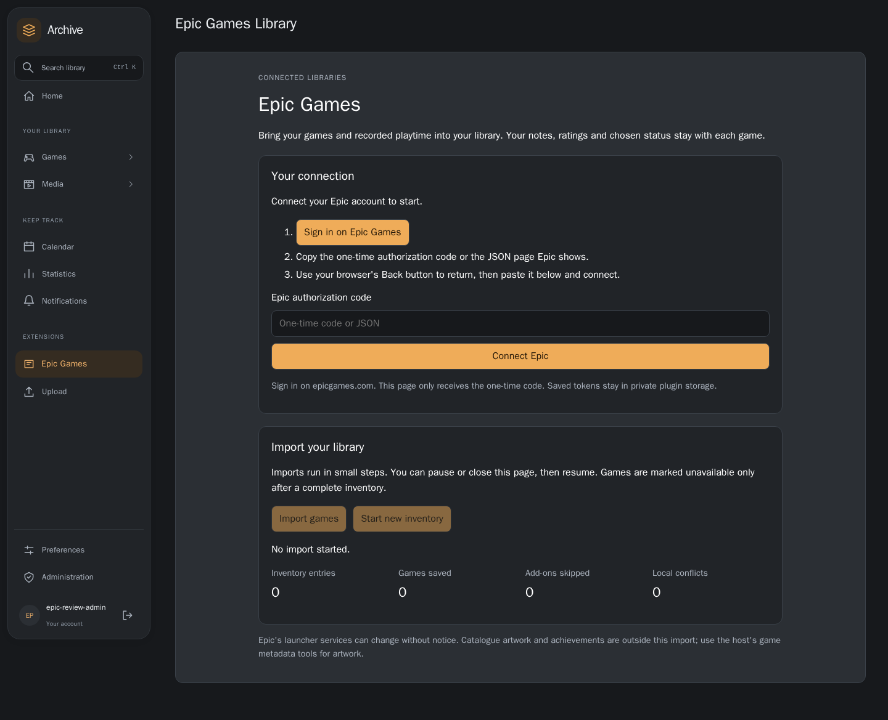
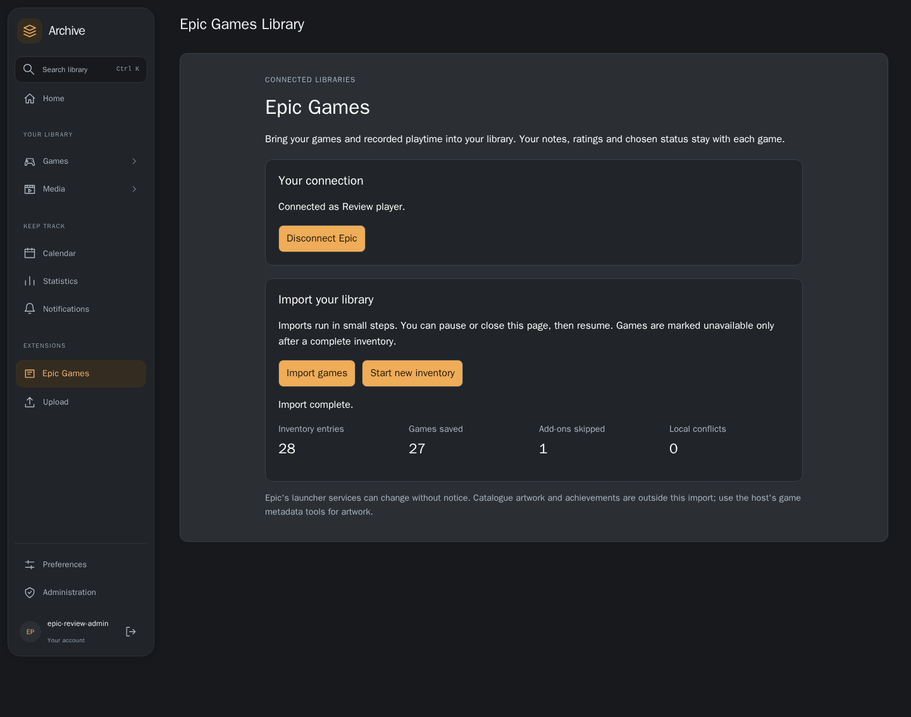

# Epic installed-package validation

The implementation PR records a disposable host, real PostgreSQL database and
real plugin runtime executing the actual unsigned `.utp`. Provider acquisition
uses Epic-shaped HTTP fixtures: two inventory pages, two namespaces, 28 entries,
one add-on and optional playtime. Only outbound Epic HTTP acquisition is
substituted; permissions, actor context, storage, installation and game writes
use the host's real implementations.

The local runtime uses explicit reduced process isolation because Bubblewrap
is unavailable. These results validate functionality and public contracts;
they do not establish production sandbox security or live Epic service success.
Branch previews require explicit unverified-install consent and administrator
reauthentication. No signing keys or session cookies are included in evidence.

`tools/check_epic_host.py` uses only public host HTTP endpoints. It verifies
installation, repeated imports, personal state, provider failure/resume, another
user's isolation, complete empty inventories, worker restart and disconnect.
`tools/capture_epic_host.mjs` exercises the installed opaque sandbox through the
actual host bridge at 390px/light and 1440px/dark. It checks external sign-in,
safe invalid-code errors, immediate code clearing and pause/reload/resume. Epic
sign-in is intercepted with a provider page fixture; no real session is used.

For a configured disposable validation host, provide `UI_REVIEW_USERNAME` and
`UI_REVIEW_PASSWORD` through the environment and run:

```sh
python tools/check_epic_host.py \
  --host http://127.0.0.1:8010 \
  --package .validation/dist/official.epic-games-0.0.1.utp \
  --evidence .validation/epic-evidence \
  --fixture-state /path/to/fixture.json --browser
```

The environment must supply an HTTP fixture with the inventory/catalogue records
described above and failure flags `inventory_failure`, `playtime_failure` and
`empty` in the specified control file. Use the test fixtures in
`tests/test_epic_games.py` as protocol references. This tool does not configure
production providers or replace the normal deployment startup.

`--reuse` previews and explicitly replaces the existing disposable installation,
binding consent to its installed version and the candidate digest. It retains
private storage and existing imports. `--browser-only --reuse` repeats just the
reviewed replacement and browser checks after a previous API run. Temporary
browser cookies are removed even when validation fails.

Live validation still requires a person to sign in on Epic's own site and verify
their library. Catalogue artwork, achievements and automatic background sync
remain outside this initial plugin.

## Recorded acceptance

The [public API report](../assets/epic-games/conformance.json) records replay,
personal-state preservation, provider failure recovery, user isolation,
availability, worker restart and disconnect. The
[browser report](../assets/epic-games/browser-conformance.json) records both
viewports, external navigation, invalid-code handling and pause/reload/resume.
These captures show the actual installed package against provider HTTP fixtures.

### Phone, light appearance





### Desktop, dark appearance




