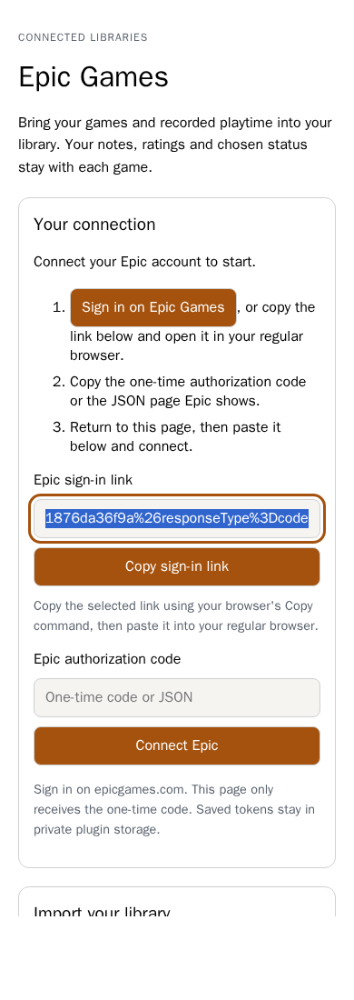
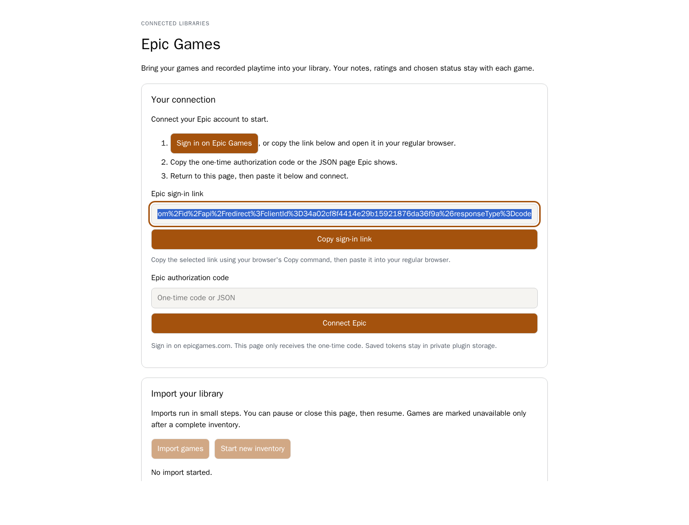

# Epic Games Library

The official `official.epic-games` plugin keeps Epic connection and import behavior
outside the core app. It requires the host's additive **Plugin API 1.1.3**
`games.import` contract. Its sandboxed page offers personal sign-in, imports,
pause/resume and disconnect through declared actions.

Sign in on Epic's own site and submit its one-time code. Use **Copy sign-in link**
to open Epic in your regular browser while leaving the app open; if clipboard
access is unavailable, copy the selected link manually. The plugin retains
rotating tokens in private per-user storage and saves the replacement refresh
token before later requests. Runtime storage is isolated by filesystem permissions
and is not encrypted at rest. Protect deployment data and backups.

The access-token lifetime must be a positive finite number. A provider lifetime
longer than one day is accepted, while local refresh still occurs at the shorter
of the provider lifetime and one day. Invalid lifetimes keep the previous
connection rather than replacing it.

The regular-browser option leaves this page open. These screenshots exercise the
packaged frontend's opaque sandbox with a status/action fixture; they do not
claim a successful live account connection.

Each action performs bounded work: one inventory page, optional playtime, one
catalogue namespace batch or a host import of at most 25 games. The saved checkpoint
survives errors and page closure. Namespace/catalogue identities are scoped to
the connected account and host actor; manual status, notes, ratings and field
locks remain under the host's import policy. Complete valid inventory is required
before marking missing games unavailable. Games are never deleted by the plugin.

Permissions are `games.write`, `network.outbound`, `plugin.storage` and
`frontend.navigation.main`. There are no host source imports, direct database
connections, native frontend permission or automatic background requests.

See the [plugin README](https://github.com/obsoletelabs/unnamed_tracking_app_plugins/blob/main/official/epic-games/README.md)
for build/install instructions, limitations and protocol references. Branch CI
supplies an unsigned `.utp` preview; signed publication uses the existing protected
official pipeline. Live-account validation requires signing in on Epic itself;
provider fixtures alone do not establish live service success.

Regression coverage is in `tests/test_epic_games.py`, including malformed paging,
rotating tokens, namespace collisions, DLC filtering, optional playtime,
permission denial and replay after a host commit/checkpoint failure. Browser and
actual packaged runtime/database evidence are linked in the implementation PR.

See [installed-package validation](epic-games-validation.md) for the repeatable
checks, provider-fixture boundaries and limitations.
